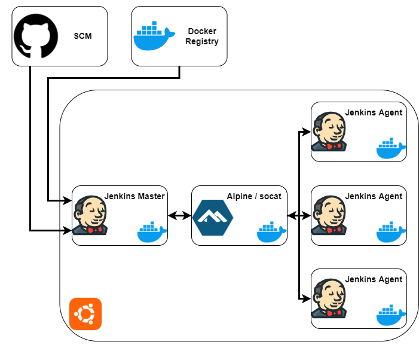

# Jenkins
## Setup Jenkins using Docker

In this installation I use 1 server in total and using Docker to run Jenkins.
- 1 Ubuntu Server + Docker
- 1 Jenkins Master
- 1 Alpine/Socat
- Jenkins Agents

Installation used as below:
- **OS :** Ubuntu 22.04.2 LTS
- **Docker :** Docker version 24.0.7

Installation Diagram:

Installation steps:
- 1 [Docker](https://github.com/luthfanzulfauzi/jenkins/blob/main/docker/docker_install.md)
- 2 [Jenkins Master](https://github.com/luthfanzulfauzi/jenkins/blob/main/master/docs/jenkins_master.md)
- 3 [Jenkins Cloud Agent](https://github.com/luthfanzulfauzi/jenkins/blob/main/agent/docs/jenkins_cloud_agent.md)
- 4 Sample python project pipeline : [link](https://github.com/luthfanzulfauzi/simple-python-pyinstaller-app/blob/master/jenkins/Jenkinsfile)
